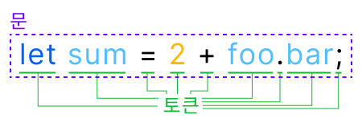
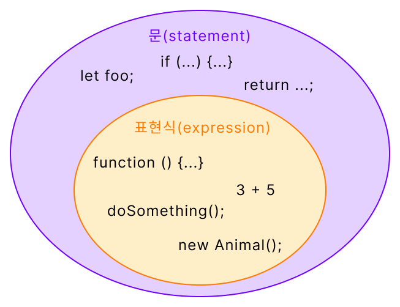

## 요약

문(statement)이란 토큰(token)으로 구성된 프로그램의 최소 실행 단위이다. 선언문, 할당문, 조건문, 반복문 등, 문을 통해 컴퓨터가 어떤 작업을 수행하도록 명령할 수 있다. 문의 집합이 프로그램이며, 문을 작성하고 순서에 맞게 나열하는 작업을 프로그래밍이라 한다.

표현식(expression)이란 값으로 평가될 수 있는 문을 말한다. 즉 변수에 할당할 수 있는 문을 말한다.

 

## 문

**문(statement)**이란 **프로그램을 구성하는 최소 실행 단위**이다. 문의 집합이 프로그램이며, 문을 작성하고 나열하는 과정을 프로그래밍이라 할 수 있다.

### 토큰

문은 다시 **토큰(token)**이라는 요소로 구성된다. 토큰은 프로그램에서 가장 작은 구성요소로, **문법적으로 더 이상 나눌 수 없는 최소 단위**이다. 토큰에는 다음과 같은 것들이 있다.

- 키워드: `let`, `const`, `await`, `if`...
- 식별자: 변수, 함수, 클래스, 프로퍼티 등의 이름
- 연산자: `+`, `-`, `&&`, `===`, `.`, `tyepof`...
- 리터럴: `42`, `"hello"`, `[1, 2, 3]`, `true`...

### 문의 종류

문은 명령문(command statement)이라고도 한다. 즉 문을 통해 컴퓨터에게 특정한 작업을 수행하도록 명령을 내릴 수 있다.

- 선언문(declaration)
  - `let foo;`
  - `function bar() {...}`

- 할당문(assignment)
  - `foo = 36;`

- 조건문(conditional)
  - `if (a > b) {...}`

- 반복문(iteration)
  - `for (let i = 0; i < 10; i++) {...}`
  - `while (a > 10) {...}`
- ...

 

## 표현식

**표현식(expression)**이란 **값으로 평가될 수 있는 문**을 말한다. 즉 문의 실행 결과로 어떠한 값을 생성하거나 참조하고, 이를 변수에 할당할 수 있다면 표현식이라고 볼 수 있다.

따라서 어떤 문이 표현식인지 아닌지 확인하는 가장 간단한 방법은 변수에 할당해 보는 것으로, 표현식이 아닌 문을 할당하려 하면 `SyntaxError`가 발생한다.

> **평가(evaluate)**란 식을 해석해서 값을 생성하거나 참조하는 것을 말한다.
>
> - `3 + 5`: 평가의 결과로 값 `8`을 생성한다.
> - `foo.bar`: 평가의 결과로 `foo` 객체의 `bar` 프로퍼티의 값을 참조한다.

또한 표현식은 JavaScript CLI 환경에서 입력했을 때 평가된 값을 출력한다. 표현식이 아닌 문은 `undefined`를 출력한다.

하지만 반환값이 없는 함수의 호출처럼 평가된 값이 `undefined`인 표현식도 있기 때문에, 이것만으로 표현식인지 아닌지를 판별하는 건 확실하지 않다. 값을 출력한다면 표현식이라고 참고만 하자.

 

## 참고 자료

- 이웅모, 『모던 자바스크립트 Deep Dive』

- [JavaScript Keywords and Identifiers (programiz.com)](https://www.programiz.com/javascript/keywords-identifiers)
- [문 및 선언 - JavaScript | MDN (mozilla.org)](https://developer.mozilla.org/ko/docs/Web/JavaScript/Reference/Statements)

