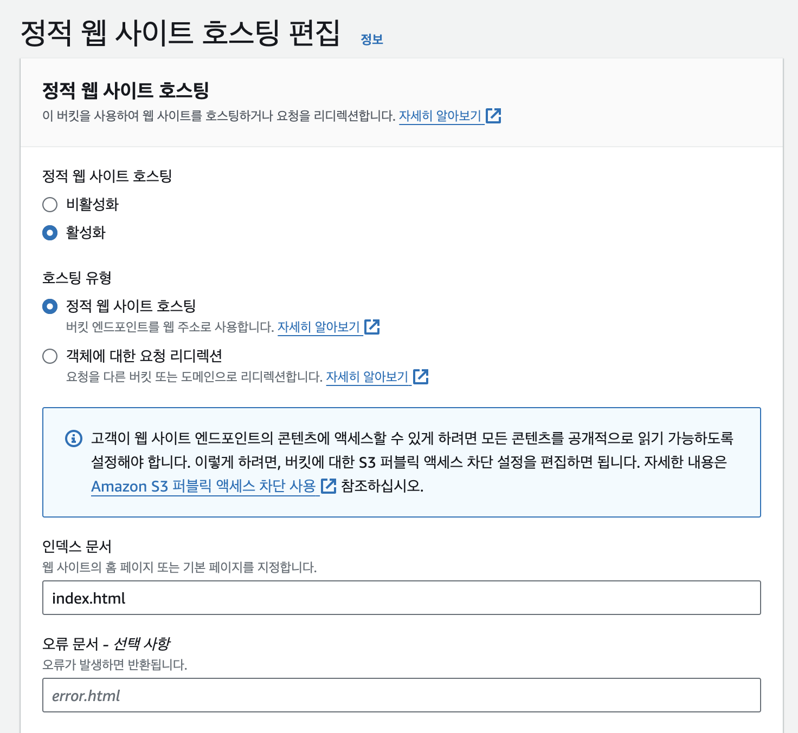
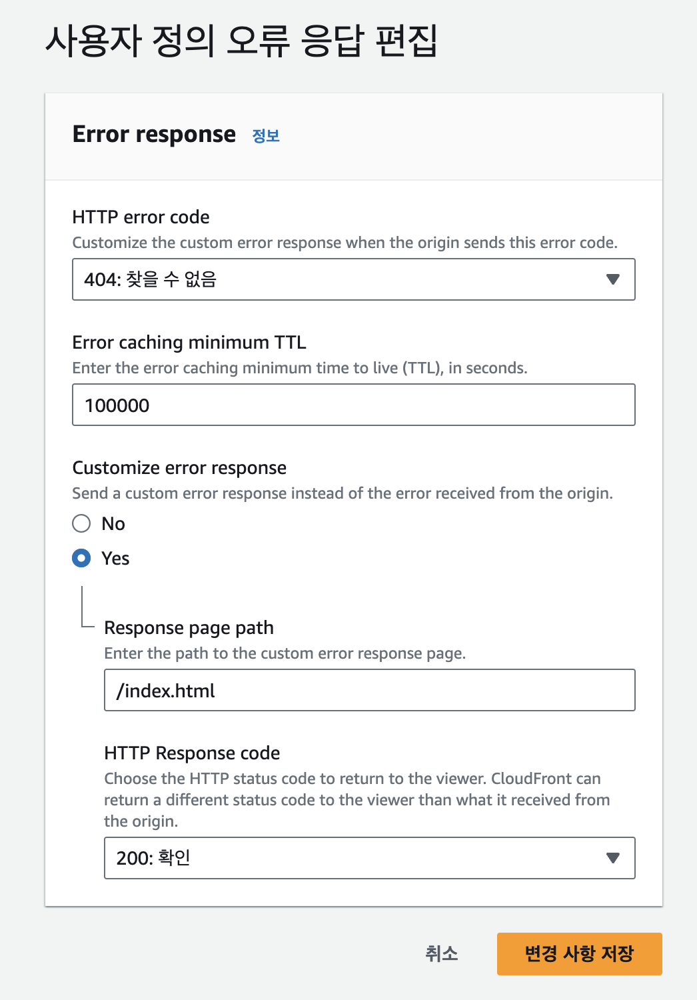

실무에서 정적 사이트 배포 환경을 구성하며 겪은 이슈입니다. 

## SPA란?

**Single-page application**의 줄임말로, 말 그대로 단일 문서로 이루어진 웹사이트를 의미합니다. 페이지별로 HTML파일이 존재했던 고전적인 방식의 사이트와 달리 하나의 HTML로 구현되기 때문에, 사이트 내의 컨텐츠는 Javascript를 통해 동적으로 생성합니다.

Angular를 필두로 React, Vue 등 쟁쟁한 SPA 프레임워크가 등장하며 프론트엔드 개발의 주류로 자리매김합니다.

단일 문서를 사용하기에 **클라이언트 사이드 라우팅**을 통해 페이지 이동을 구현하며, 새로운 문서를 로드하지 않고 화면이 전환되므로 사용자는 쾌적한 사이트 이용 경험을 얻을 수 있습니다.

## 클라이언트 사이드 라우팅이란?

SPA에서 사용자가 링크를 클릭할 때마다 페이지를 새로고침하지 않고 다른 페이지로 이동하기 위한 개념입니다. 크게 다음 두 가지 기능을 포함합니다.

- URL 변경을 감지해 그 경로에 매핑된 컴포넌트를 렌더링합니다.

- 새로고침을 유발하지 않고 사용자의 URL을 임의로 조작합니다.

사용자의 URL을 변경하는 방식은 또다시 두 가지로 구분할 수 있습니다.

1. `window.history` API를 사용:

    `window.history` API의 `pushState`, `replaceState` 등의 메서드를 사용하여 새로고침을 유발하지 않고 URL을 변경하는 방식입니다. Svelte의 svelte-routing 라이브러리가 이에 속합니다.
    
    URL의 실제 경로를 변경하므로 정적 사이트로 배포할 경우, 후술할 404 오류 이슈를 유발합니다. 

2. hash property를 사용:

    `Location` 인터페이스의 [**hash property**](https://developer.mozilla.org/en-US/docs/Web/API/Location/hash)를 사용하는 방식으로 Svelte의 svelte-spa-router 라이브러리가 이에 속합니다.
    
    hash property란 URL의 뒤에 `#`과 함께 붙는 값으로, 본래는 현재 페이지 내에서 Hash property를 id로 갖는 엘리먼트 위치로 스크롤하는 역할을 합니다.
    
    `#` 뒤에 붙는 값은 기본적으로 브라우저 상에서만 인식되고, 서버 측에는 전달되지 않기 때문에 새로운 페이지 로드를 유발하지 않습니다. 이러한 특성으로 클라이언트 사이드 라우팅에 사용되기도 합니다. 한편 SEO에는 불리한 면이 있습니다.

저는 원래 2번 방식 기반의 라이브러리를 사용했기 때문에 큰 문제가 없었지만, 모종의 이유로 1번 방식으로 교체하면서 이슈를 겪게 되었습니다.

## SPA routing 404 오류 이슈

본디 URL이란 사용자가 원하는 리소스를 요청하기 위한 경로를 의미합니다. 즉, `https://foo.bar/baz`라는 주소로 요청을 한다면, `https://foo.bar` 웹 서버는 기본적으로 `./baz.html` 파일을 찾아서 응답으로 전송합니다.

그러나 SPA는 단일 문서(`./index.html`)만이 존재하기 때문에, 다른 경로로 이동한 상태에서 새로고침 등으로 새 문서 로드를 유발하면 404 오류가 발생합니다. 그 경로에 해당하는 HTML이 존재하지 않기 때문입니다.

한편 해시 라우팅을 사용한다면 이 문제는 발생하지 않습니다. 예를 들어, `https://foo.bar/#/baz`라는 URL에서 `#/baz`는 Hash property이므로 서버는 이를 인식하지 못합니다. 따라서 `https://foo.bar` 웹 서버는 `./index.html`을 응답으로 보냅니다.

어쨌든 이를 해결하기 위해서는 어떤 경로로 요청을 하든 `./index.html`을 응답으로 보내도록 처리해야 합니다.

## AWS S3, CloudFront에서 오류 페이지 핸들링

저는 AWS S3와 CloudFront로 배포 환경을 구성했기 때문에 여기서 핸들링을 할 필요가 있었습니다. S3와 CloudFront 둘 다 오류 처리 기능을 제공했기 때문에, 둘 중 하나를 택해야 했습니다.

### S3에서 오류 처리

S3의 **정적 웹 사이트 호스팅(Static website hosting)** 기능을 사용하면 오류 시 보여줄 문서를 설정할 수 있습니다.

- 장점:
    - 간편하게 설정할 수 있습니다.

    - S3의 기본 기능을 활용하기 때문에 추가적인 비용이 발생하지 않습니다.

- 단점:
   - 세부적인 오류 처리 설정이 어렵습니다.

   - 어디까지나 오류가 발생했을 때 응답으로 전송할 문서를 설정하는 것이기 때문에, 네트워크 상에서는 오류가 발생한 것으로 취급합니다.
   
   - 검색 엔진이 특정 페이지를 없는 페이지로 판단할 수 있기에 SEO에 불리할 수 있습니다.

### CloudFront에서 오류 처리

CloudFront의 **사용자 정의 오류 응답(Custom error response)** 을 사용하면 에러 코드별로 어떻게 처리할지 세세하게 설정할 수 있습니다.

- 장점:
    - 오류 코드별로 세세한 설정을 할 수 있어 유연성이 높습니다.

    - 캐싱 기능을 통해 성능을 높일 수 있습니다.

- 단점:
    - CloudFront 사용에 따른 추가 비용이 발생할 수 있습니다.

둘 중 어느 방법을 선택하든 SPA는 정상적으로 동작하게 됩니다. 단, CloudFront에서 처리하는 것이 깔끔하고 SEO 친화적이기 때문에, 저는 CloudFront에서 처리하는 방법을 선택했습니다.

## 마치며

저는 프론트엔드 개발을 Next.js로 시작했기 때문에, SPA나 CSR에 대해서는 공부할 때 잠깐 다뤄보기만 했지 실제로 배포까지 진행해본 적은 없었습니다. 그렇기에 이번에 맞딱뜨린 이 이슈는 저로서는 꽤나 생소한 것이었습니다.

아직 SSR 프레임워크가 유행하기 이전에는 아마 꽤 일반적인 이슈였을 것입니다. 서버 사이드 로직까지 다룰 수 있는 Next.js를 사용하면서 인프라에 대한 중요성을 잊고 있었던 게 아닌가 합니다.

이번 경험을 통해 프론트엔드 개발자라 할지라도 인프라와 배포 과정에 대한 충분한 이해가 필요함을 다시금 깨달았습니다. 기술이 발전하면서 개발 환경은 점점 더 편리해지고 있지만, 기본적인 원리와 문제 해결 능력은 여전히 중요한 요소일 것입니다.
